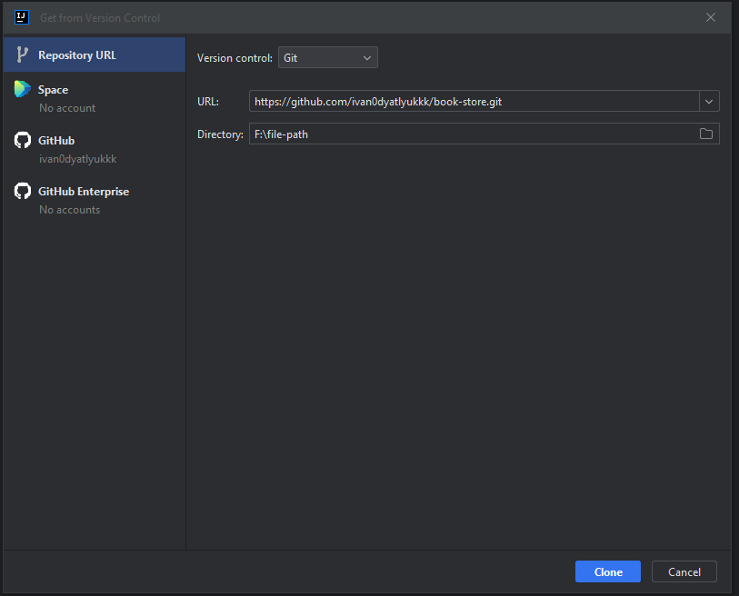

<h1 align="center">
    The BookWorm API
</h1>

## Overview
The BookWorm API 📚 provides simple APIs for managing an online bookstore. 


## Table of contents
- [👨‍💻Tech stack](#tech-stack)
- [🌟Features](#features)
- [🛠️Installation](#installation)
- [⚙️Integration with Postman](#integration-with-postman)
- [Contributing](#contributing)
- [🎯Summary](#summary)

## 👨‍💻Tech stack
Let's look at the whole list of technologies which are used in the project:
1. <p><strong>Spring Boot</strong> simplifies the development of Java-based applications by providing a pre-configured environment, it serves as the foundational framework for building the backend of the online bookstore.</p>
2. <p><strong>Spring Data JPA</strong> provides a convenient way to interact with relational databases using Java Persistence API (JPA). It reduces the boilerplate code needed for database operations and allows you to work with database entities as Java objects.</p>
3. <p><strong>Spring Security</strong> provides authentication and authorization features to secure the API endpoints and protect user data.</p>
4. <p><strong>MySQL</strong> is a popular relational database management system known for its performance and scalability. It's used to store and manage data for the online bookstore, including user information, book details, and order records.</p>
5. <p><strong>Lombok</strong> is a library that reduces the need for writing repetitive boilerplate code in Java, such as getters, setters, and constructors. It simplifies code maintenance and readability.</p>
6. <p><strong>MapStruct</strong> is a code generation tool that simplifies mapping between Java objects. It's used to map data between DTOs (Data Transfer Objects) and entity classes, reducing manual coding and improving maintainability.</p>
7. <p><strong>Docker</strong> is used for containerization, allowing us to package the application and its dependencies into isolated containers. It ensures consistent environments across different stages of development and simplifies deployment, making it easier to manage and scale the application.</p>
8. <p><strong>Liquibase</strong> is a database version control and migration tool. It allows us to manage database schema changes in a systematic and controlled manner, ensuring that database changes are applied consistently across different environments and versions of the application.</p>
9. <p><strong>Postman</strong> is a popular API testing and documentation tool. It's invaluable for testing and debugging the API endpoints during development. It also helps in documenting the API for both internal and external users.</p>
10. <p><strong>OpenAPI</strong> (Swagger) is used to describe and document the RESTful API. It enhances API documentation, allows for interactive API exploration, and aids in generating client SDKs.


## 🌟Features
In this part, let's go through all of the features.

<h3 align="center">Authorization</h3>

Firstly, you should authorize and then you will access the main API features (default role - USER).

|        FEATURE        |     Endpoint              |                         Required fields                                      |
|-----------------------|:-------------------------:|:----------------------------------------------------------------------------:|
| Register a new user   | POST:/api/auth/register   | email, password, repeat password, first name, last name, shipping address    |
| Log in                | POST:/api/auth/login      | email, password                                                              |

<h3 align="center">The main features</h3>

So, we're on the right track 🎉, now you can find all of the features for future use 🙂

|         FEATURE                                    |     Endpoint                         |     User    |    Admin    |
|----------------------------------------------------| :----------------------------------: |:---------:  | :---------: |
|Get all books                                       | GET:/api/books                       |     ✔️     |     ✔️      | 
|Get a certain book by id                            | GET:/api/books/{id}                  |     ✔️     |     ✔️      | 
|Add a new book                                      | POST:/api/books                      |     ❌     |     ✔️      | 
|Delete an existing book by id                       | DELETE:/api/books/{id}               |     ❌     |     ✔️      | 
|Update an existing book by id                       | PUT:/api/books/{id}                  |     ❌     |     ✔️      |
|Get books of the category                           | GET:/api/categories/{id}/book        |     ✔️     |     ✔️      | 
|Get all categories                                  | GET:/api/categories                  |     ✔️     |     ✔️      | 
|Get a certain category by id                        | GET:/api/categories/{id}             |     ✔️     |     ✔️      | 
|Add a new book category                             | POST:/api/categories                 |     ❌     |     ✔️      | 
|Delete an existing category by id                   | DELETE:/api/categories/{id}          |     ❌     |     ✔️      |
|Get a user's shopping cart                          | GET:/api/cart                        |     ✔️     |     ❌      |
|Add a book to a shopping cart                       | POST:/api/cart                       |     ✔️     |     ❌      |
|Update a cart item by its id                        | PUT:/api/cart/cart-item/{id}         |     ✔️     |     ❌      |
|Delete a cart item by its id                        | DELETE:/api/cart?car-item/{id}       |     ✔️     |     ❌      |
|Get all orders                                      | GET:/api/orders                      |     ✔️     |     ❌      |
|Get  order items by order id                        | GET:/api/orders/{id}/items           |     ✔️     |     ❌      |
|Get a certain order item by an order id and its id  | GET:/api/orders/{orderId}/items/{id} |     ✔️     |     ❌      |
|Update a status of an order by an order id          | PATCH:/api/orders/{id}               |     ❌     |     ✔️      |


## 🛠Installation
Okay, after the features overview let's start setting our environment up for running the application 🚀.

### Prerequisites
There are some things which you should install locally on your PC.
- Java 17 (https://www.oracle.com/java/technologies/javase/jdk17-archive-downloads.html)
- Maven (https://maven.apache.org/download.cgi)
- Docker (https://www.docker.com/)

### Installation
Let's look at the steps of installing the application:
1. Clone the project: https://github.com/ivan0dyatlyukkk/book-store.git by using a terminal or an IDEA: <br>
    Using a terminal: <br>
   ```bash
    git clone https://github.com/ivan0dyatlyukkk/book-store.git
   ```
   Using the IntelliJ IDEA: <br>
   Click on "Get from VCS" -> Paste the link ```bash https://github.com/ivan0dyatlyukkk/book-store.git``` in an appropriate field
   
   

   
2. Build the project by Maven
   ```bash
   mvn clean install
   ```

4. Compose the project by Docker Compose tool:
    ```bash
    docker-compose build

5. Run the application: <br>
   ```bash
   docker-compose up
   ```
Great! We already set our environment up! ⭐
 
## ⚙Integration with Postman
   If you don't want to come up with an idea of data for the testing requests, and you don't want to type lots of similar requests again and again, you can use the prepared [collection for Postman](#postman-collection) and the [environment](#postman-environment)

## Contributing
We appreciate your interest in contributing to this project! <br>
Your help and input are valuable in making this project better for everyone. <br>
Whether you want to report a bug, request a feature, or submit a pull request, you can follow [🛠Installation](#installation). <br>
If you have any questions, need further information, or wish to explore opportunities for collaboration in the development of this project, feel free to reach out to me. <br>
My email: `studdyatlyuk21@gmail.com`


## 🎯Summary
<strong><i>The BookWorm API</i></strong> is a powerful tool designed to create a seamless and user-friendly experience for book enthusiasts and administrators alike. It serves as the backbone for managing a virtual library of literary treasures and facilitates the process of discovering, purchasing, and managing books. 

The video instructions for usage you can watch here:
[loom-video](https://www.loom.com/share/aa48bd7d22ee43bdb4acd0356d3a19d1?sid=4cb89221-9b2b-4eb3-a4d7-530a01d9edfb)

Let's try! Just use the link: [book-worm-api](http://ec2-107-23-190-56.compute-1.amazonaws.com/api/swagger-ui/index.html#/)

[postman-collection]:Book-store.postman_collection.json
[postman-environment]:Book-store.postman_environment.json
